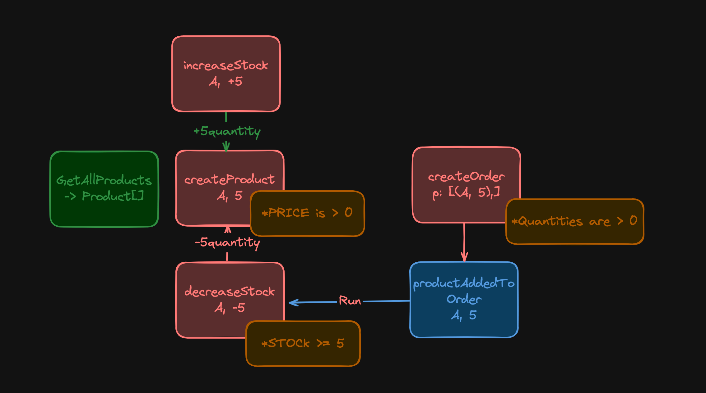

# CQRS Inventory System

Take a look at working backend system example to manage inventory inside a company.

> Joi and MongoDB is not yet connected. To see how to do it with Docker take a look at [Express and MongoDB at my website](https://quak.com.pl/learn/node/dockerize-express-and-mongo/).

*Included 0 dependencies libs(written only for this project):*
- [/lib/Base Errors](/lib/base-errors.ts)
- [/lib/CQRS](/lib/cqrs.ts)
- [/lib/Money](/lib/money.ts)

## Business problem:



## Solution:
- API that handles: `Products`(Creation/Availability of them) and `Orders`
- `Concurrent` writes protection system (look for version field and getCurrentVersion method)
- `CQRS` pattern to distinguish business behaviors and separate writes/reads
- `ExpressJS` API with `Typescript` to ensure proper typing
- `MongoDB`/`InMemory` as our database/persistence layer(*in-memory for testing, Dependency Inversion principle used*)
- ~~Input validation with `joi`~~ - not yet
- ~~`Unit` and `Integration` Tests to test our business logic with `Jest`~~ - not yet, but prepared interfces and Dependency Inversion pattern
- `Domain Driven Design` to help with business rules

## Run: 

> Joi and MongoDB is not yet connected. To see how to do it with Docker take a look at [Express and MongoDB at my website](https://quak.com.pl/learn/node/dockerize-express-and-mongo/).

Prerequisites:
- Node v20+

Ensure you have proper `.env` file:
```env copy
# stage can be 'DEFAULT' | 'TESTS'
STAGE=TESTS
PORT=3000
```
To start local server simply run:
```bash copy
# Run with in-memory repo's
$ npm i
$ npm run build
$ npm run dev
```

## Author:
2024, Kacper Walczak [website](https://quak.com.pl)
